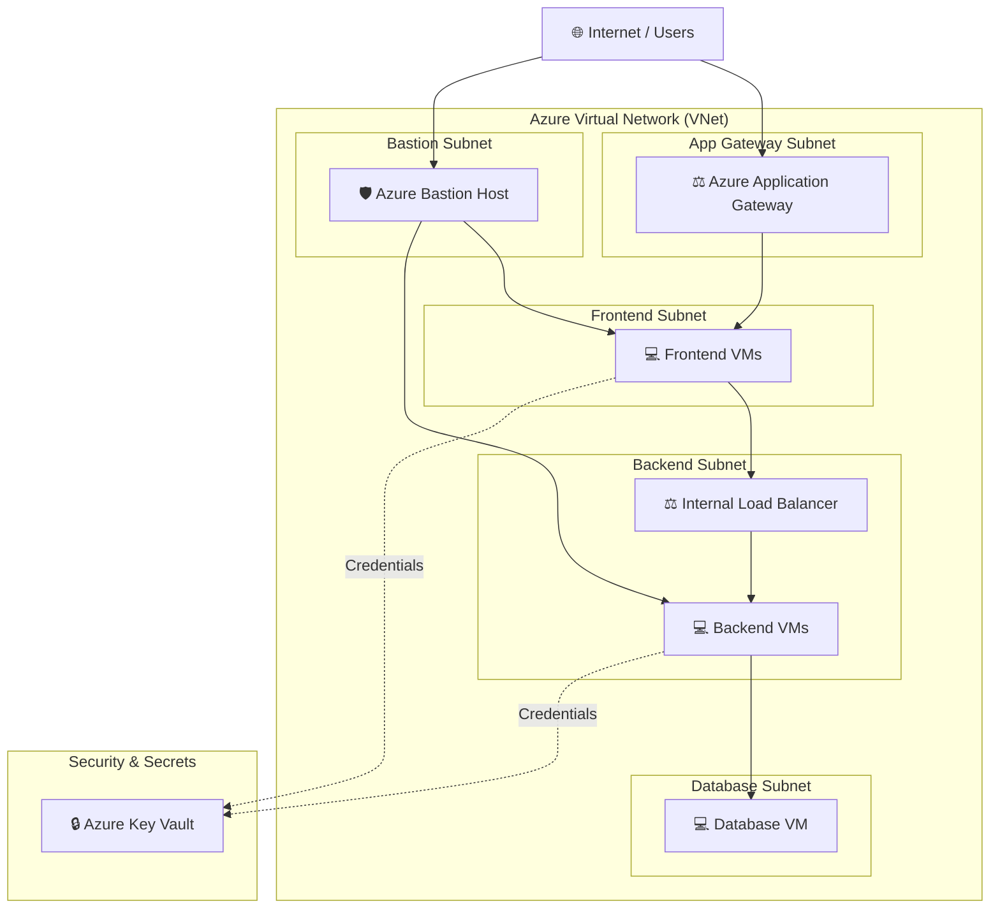

# 🚀 Azure Infrastructure as Code (IaC) - Terraform Pipeline ☁️

[](https://www.terraform.io/)
[](https://registry.terraform.io/providers/hashicorp/azurerm/latest)
[](https://github.com/patelsurender58-ai/Infra)

> 🏗️ **Enterprise-Grade Azure Infrastructure Provisioning using Modular Terraform Architectures**

---

## 📋 Table of Contents

- [📌 Project Overview](#-project-overview)
- [🏛️ Architecture & Components](#️-architecture--components)
- [📂 Directory Structure](#-directory-structure)
- [📦 Terraform Modules](#-terraform-modules)
- [🌍 Environments](#-environments)
- [⚡ Prerequisites](#-prerequisites)
- [🚀 Getting Started](#-getting-started)
- [🔒 Security & Best Practices](#-security--best-practices)

---

## 📌 Project Overview

This repository contains modularized **Terraform Infrastructure as Code (IaC)** configurations for provisioning secure, scalable, and highly available multi-tier Azure cloud environments.

### 🌟 Key Highlights

- 🧩 **Modular Design**: Fully decoupled reusable Terraform modules for Azure services.
- 🔁 **Multi-Environment Support**: Built-in support for multiple deployment environments (`preprod`, `pord`).
- 🔐 **Enhanced Security**: Integrated Azure Key Vault for credentials, Azure Bastion for secure management access, and Private Subnets.
- ⚖️ **Load Balancing & Traffic Management**: Azure Application Gateway (L7) and Azure Load Balancer (L4) integration.
- 🖥️ **Multi-Tier VM Compute**: Provisioning of Frontend, Backend, and Database tier instances.

---

## 🏛️ Architecture & Components



---

## 📂 Directory Structure

```ascii
📁 Infra-SP/
├── 📁 environments/
│   ├── 📁 pord/                       # 🏬 Production Environment
│   │   ├── 📄 main.tf                 # Environment module orchestrations
│   │   ├── 📄 provider.tf             # AzureRM provider settings
│   │   ├── 📄 variable.tf             # Input variables
│   │   └── 📄 terrafrom.tfvars        # Environment values & inputs
│   └── 📁 preprod/                    # 🧪 Pre-Production Environment
│       ├── 📄 main.tf
│       ├── 📄 provider.tf
│       ├── 📄 variable.tf
│       └── 📄 terrafrom.tfvars
└── 📁 module/                         # 🧩 Reusable Infrastructure Modules
    ├── 📁 azurerm_application_gateway/ # ⚖️ App Gateway (L7 Load Balancer)
    ├── 📁 azurerm_bastion/             # 🛡️ Bastion Host for SSH/RDP
    ├── 📁 azurerm_key_vault/           # 🔒 Key Vault & Secret Store
    ├── 📁 azurerm_load_balancer/       # ⚖️ Azure Load Balancer (L4)
    ├── 📁 azurerm_public_ip/           # 🌐 Static & Dynamic Public IPs
    ├── 📁 azurerm_resource_group/      # 📦 Azure Resource Groups
    ├── 📁 azurerm_subnet/              # 📐 Subnets & NSG Rules
    ├── 📁 azurerm_virtual_machine/     # 💻 Linux/Windows VMs
    └── 📁 azurerm_virtual_network/     # 🌐 Virtual Networks (VNets)
```

---

## 📦 Terraform Modules

| Icon | Module Name | Description | Key Features |
| :---: | :--- | :--- | :--- |
| 📦 | **`azurerm_resource_group`** | Azure Resource Group management | Multi-region support, resource tags |
| 🌐 | **`azurerm_virtual_network`** | VNet infrastructure | Address space allocation, peering |
| 📐 | **`azurerm_subnet`** | Network subnets | Multi-subnet mapping, service endpoints |
| 🌐 | **`azurerm_public_ip`** | Public IP addresses | Static/Dynamic allocation, Standard SKU |
| 🔒 | **`azurerm_key_vault`** | Secrets & key management | Secret retrieval, access policies |
| 💻 | **`azurerm_virtual_machine`**| VM Compute infrastructure | NIC creation, OS images, password fetch |
| 🛡️ | **`azurerm_bastion`** | Secure jump server access | PaaS Bastion host, IP associations |
| ⚖️ | **`azurerm_application_gateway`** | Layer 7 Web Load Balancer | HTTP/HTTPS listeners, routing rules |
| ⚖️ | **`azurerm_load_balancer`** | Layer 4 Internal Load Balancer | Health probes, backend pool rules |

---

## 🌍 Environments

- **`pord`**: Production environment configuration targeting high availability and production scale.
- **`preprod`**: Pre-production staging environment for integration testing and pre-release verification.

---

## ⚡ Prerequisites

Ensure you have the following installed on your local machine / runner:

- 🛠️ [Terraform CLI](https://developer.hashicorp.com/terraform/downloads) `v1.5.0+`
- 💻 [Azure CLI](https://docs.microsoft.com/en-us/cli/azure/install-azure-cli) `v2.40.0+`
- 🔑 Active [Azure Subscription](https://azure.microsoft.com/) with proper RBAC permissions (Contributor/Owner).

---

## 🚀 Getting Started

### 1️⃣ Authenticate to Azure 🔑

```bash
az login
az account set --subscription "YOUR_SUBSCRIPTION_ID"
```

### 2️⃣ Navigate to Target Environment 📂

```bash
cd environments/pord
```

### 3️⃣ Initialize Terraform ⚙️

```bash
terraform init
```

### 4️⃣ Preview Execution Plan 🔍

```bash
terraform plan -var-file="terrafrom.tfvars"
```

### 5️⃣ Apply Configuration 🚀

```bash
terraform apply -var-file="terrafrom.tfvars"
```

---

## 🔒 Security & Best Practices

- 🔐 **Zero Hardcoded Secrets**: Secrets and admin passwords are stored and referenced directly from Azure Key Vault.
- 🛡️ **Network Isolation**: VMs are provisioned without direct Public IPs; administration is securely gated through Azure Bastion.
- 🏷️ **Resource Naming & Tagging**: Standardized naming conventions across all environments.

---

Made with ❤️ and 🤖 Terraform
